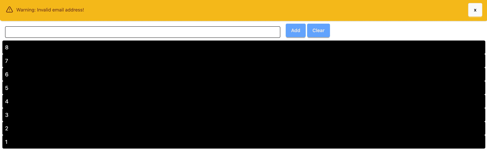

# 使用 Alpine.js、Tailwind CSS 和 DaisyUI 打造互動式前端應用

在這篇文章中，我們將探討如何結合 **Alpine.js**、**Tailwind CSS** 和 **DaisyUI**，快速構建一個互動式的前端應用。這個專案展示了如何實現通知提示、輸入框與清單管理等功能，並且保持代碼簡潔且易於維護。

---

## 專案概述 



這個專案的目標是構建一個簡單的前端應用，包含以下功能：

1. 通知提示：顯示警告通知，並支援手動關閉。
2. 輸入框與清單管理：用戶可以輸入文字，將其新增到清單中，或清空整個清單。

技術棧：

* **Alpine.js**：用於簡化前端互動邏輯。
* **Tailwind CSS**：提供強大的 CSS 工具類別。
* **DaisyUI**：基於 Tailwind CSS 的 UI 元件庫，快速構建美觀的介面。

---

## 專案結構

以下是專案的目錄結構：

```
├── app.js          # 主程式入口，初始化 Alpine.js
├── hello.js        # 定義輸入框與清單管理的邏輯
├── notify.js       # 定義通知提示的邏輯
├── index.html      # 主頁面，整合所有功能
├── style.css       # 自定義樣式，基於 Tailwind CSS 和 DaisyUI
├── vite.config.ts  # Vite 配置檔案
├── package.json    # 定義專案依賴
└── node_modules/   # npm 安裝的依賴
```

## Alpine.js 初始化與模組化邏輯

### Alpine.js 初始化

app.js 是專案的主程式入口，負責初始化 Alpine.js 並將邏輯模組綁定到 `x-data`，實現模組化的前端互動邏輯。

app.js 的邏輯
```javascript
import Alpine from 'alpinejs'
import Hello from './hello.js'
import Notify from './notify.js'

// 綁定 Hello 和 Notify 函數到 Alpine.js 的 x-data
Alpine.data('obj', Hello) 
Alpine.data('notify', Notify)

// 啟動 Alpine.js
Alpine.start()
```
---

功能說明
1. 模組化邏輯：
    - Hello：負責輸入框與清單管理的邏輯。
    - Notify：負責通知提示的邏輯。
2. 綁定到 HTML：
    - 使用 `Alpine.data` 將邏輯模組綁定到 `x-data`，讓 HTML 元素可以直接使用模組中的方法與屬性。
3. 啟動 Alpine.js：
    - 使用 Alpine.start() 啟動框架，讓所有 x-data 和指令生效。
---

關鍵點
- `Alpine.data`：
    - Alpine.js 提供的 API，用於將 JavaScript 函數綁定到 HTML 的 `x-data`。
    - 例如，`Alpine.data('obj', Hello)` 將 `Hello` 函數綁定到 `x-data="obj"`。
- `Alpine.start()`：
    - 啟動 Alpine.js 的必要步驟，確保所有的互動邏輯正常運行。
---

## 核心功能與實現

1. 通知提示
通知提示功能由 notify.js 提供邏輯支持，並在 index.html 中透過 Alpine.js 的 `x-data` 和 `x-if` 指令進行綁定。

notify.js
```javascript
const Notify = () => ({
    show: true, // 控制通知顯示的狀態
    init() {
        console.log('通知初始化完成');
    },
    dismiss() {
        this.show = false; // 隱藏通知
    }
});

export default Notify;
```

index.html 的通知模板
```html
<template x-data="notify" x-if="show">
    <div role="alert" class="flex justify-between items-center alert alert-warning">
        <div class="flex gap-2 items-center">
            <svg xmlns="http://www.w3.org/2000/svg" class="h-6 w-6 shrink-0 stroke-current" fill="none" viewBox="0 0 24 24">
                <path stroke-linecap="round" stroke-linejoin="round" stroke-width="2" d="M12 9v2m0 4h.01m-6.938 4h13.856c1.54 0 2.502-1.667 1.732-3L13.732 4c-.77-1.333-2.694-1.333-3.464 0L3.34 16c-.77 1.333.192 3 1.732 3z" />
            </svg>
            <span>Warning: Invalid email address!</span>
        </div>
        <div>
            <button class="btn" @click="dismiss">x</button>
        </div>
    </div>
</template>
```

- 關鍵點：
    - 使用 `x-data="notify"` 綁定 notify.js 的邏輯。
    - 使用 `x-if="show"` 控制通知的顯示與隱藏。

---

2. 輸入框與清單管理

輸入框與清單管理功能由 hello.js 提供邏輯支持，並在 index.html 中透過 Alpine.js 的 `x-data`、`x-model` 和 `x-for` 指令進行綁定。

hello.js 的邏輯

```javascript
const Hello = () => ({
    show: false, // 控制清單顯示的狀態
    input_text: "", // 綁定輸入框的文字
    numbers: [], // 儲存清單的內容
    addText() {
        if (this.input_text !== "") {
            this.numbers.unshift(this.input_text); // 新增文字到清單
            this.input_text = ""; // 清空輸入框
        }
        this.show = true; // 顯示清單
    },
    clearText() {
        this.numbers = []; // 清空清單
    }
});

export default Hello;
```

index.html 的輸入框與清單模板

```html
<div x-data="obj" class="m-2">
    <div class="grid grid-cols-12 gap-2">
        <input class="col-span-7 rounded m-2 px-2 py-1 border border-ember-900" 
               x-model.trim="input_text" 
               @keyup.enter="addText" 
               type="text">
        
        <div class="col-span-3 flex gap-1">
            <button class="btn btn-neutral bg-blue-400 border-none" @click="addText">Add</button>
            <button class="btn btn-neutral bg-blue-400 border-none" @click="clearText">Clear</button>
        </div>
    </div>

    <ul>
        <template x-for="num in numbers">
            <li x-text="num" class="btn-primary"></li>
        </template>
    </ul>
</div>
```

- 關鍵點：
    - 使用 `x-data="obj"` 綁定 hello.js 的邏輯。
    - 使用 `x-model.trim="input_text"` 雙向綁定輸入框的值。
    - 使用 `x-for="num in numbers"` 動態渲染清單項目。

---

3. 自定義樣式

專案使用 Tailwind CSS 和 DaisyUI 提供的樣式，並在 style.css 中進行自定義

style.css 的內容

```css
@import "tailwindcss";
@plugin "daisyui";

.btn-primary {
    @apply rounded p-2 cursor-pointer bg-black text-white hover:bg-sky-300;
}
```

- 關鍵點：
    - 使用 `@apply` 將 Tailwind CSS 的工具類別應用到自定義樣式中。
    - 使用 DaisyUI 的按鈕樣式，快速構建美觀的按鈕。

---

## 啟動專案

1. 安裝依賴：
```sh
npm install
```

2. 啟動開發伺服器：
```sh
npm run dev
```

3. 開啟瀏覽器：
    - 預設網址為
    `http://localhost:3000`

## 結語

這個專案展示了如何使用 Alpine.js、Tailwind CSS 和 DaisyUI 快速構建互動式的前端應用。透過簡單的代碼結構與強大的工具類別，我們可以在短時間內實現高效且美觀的功能。

如果你對這些技術感興趣，不妨試著將它們應用到自己的專案中！